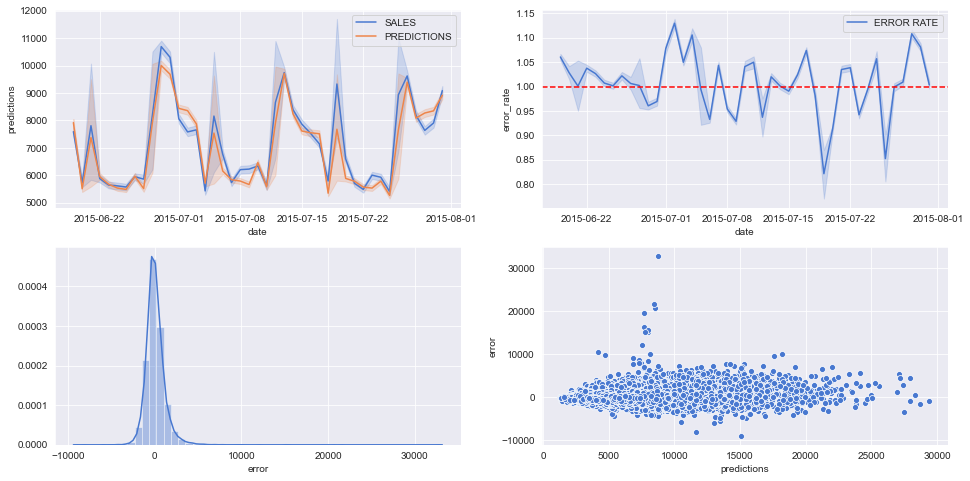

# Rossmann stores sales prediction


## The dataset
In this course, we used the [Rossmann Store Sales](https://www.kaggle.com/c/rossmann-store-sales) dataset from Kaggle. I'll leave you to check the dataset.

---
 This project was developed using the method**CRISP-DS (CRoss-Industry Process - Data Science)**, a very interesting and iterable approach for Data Science projects which enable us, in each iteration, to:
- Deliver an end-to-end version of the solution.
- Have a faster value delivery.
- Map all the possible problems thay we may find during the project development.


# 1.0 The context

In a quarterly report meeting at Rossmann, the directors board identified an increase in competitors stores openings.

In order to prevent the competitors from taking part of the market share, the C-Level board decided to conduct an on-site survey with all customers who were shopping at the stores to understand the following points:

- Why did the customer preferred to buy from Rossmann and not from the competition?
- From 0 to 10, how satisfied was the customer with the Rossmann store's products and service? Why? (CSAT)
- Why were there certain products that the customer preferred to buy from the competition and not from Rossmann?
- What were, in the customers opinions, the three strengths and three weaknesses from Rossmann’s stores? Why?
- From 0 to 10, how much would the customer recommend Rossmann to a friend or family member? Why? (NPS)

After the customer survey, the following insights were identified:

- Customers preferred to buy from the competition because the service was better.
- Customers bought the same product from the competition because it offered better prices.
- Customers preferred to go to the competition’s store because the physical environment were more pleasant and some even had a cafeteria chain inside them.

**Key points:**
- Understand the context.
- Spot the root cause of the problem.
- Identify the project sponsor.
- Outline the solution's key points:
  - Granularity
  - The problem type
  - Elegible methods to solve the problem
  - How it'll be delivered

# 2.0 The problem
Based on the research insights, initiatives have been outlined such as: 

- Redesign the entire training program for store managers and attendants.
- Review the entire pricing strategy.
- Make partnerships with chains of coffee shops and bakeries.
- Deploy self-service totems to customers who preferred to shop without the assistance of attendants.

However, to carry out all these initiatives, well-structured financial planning with a minimum margin of error must be made so that the company wouldn't waste money during the implementation of the initiatives.

The CFO responsible for this plan had a huge difficulty to carry it out because it was necessary to know how much each store was selling and **how much it could sell in the short term**. In addition, there was no easy, automated, or convenient way to obtain this information.

<br>

### Problem statement
This statement was defined after identifying the root cause of the problem and interviwed the stakeholders to understand the business as a whole. 

> *How might we identify the budget needed for renovations for each store?*
<br>


# The solution

### Solution statement
This statement was defined after doing the Exploratory Data Analysis, since this phase gives us a clear business overview. 

> *We can use Time Series do predict the sales for each store in the next 42 days (six weeks).*
The delivered solution was a Telegram bot. 

The user just needed to send the store number and the bot would answer the predicted **total sales that the store would made by the end of the next six weeks**.


# Architecture


<br>

## Data Description

**Key points:**
- Know the dataset size:
  - Do we have all the resources to start working on it?
  - Does our infrastructure support the volume of the information that we'll need to process?

- Variable types:
  - Which type os variables do we have in the dataset?
  - What is the percentage of each type?
    - Checking it helps us to choose the right techniques to manipulate the data.

- Missing values:
  - How many missing values do we have in the dataset?
  - Why there are missing values? (Issues: systems and/or manual input)
  - Depending on how critical is, we can decide whether not doing the project because there aren't enough data or use techniques to fill in the missing values.

- Summary statistics:
  - Get the **min, max, range, mean, median, standar deviation, skewness and kurtosis** values of the data for each numerical variable.
  
  
  
  - Plot box plot for categorical variables (`state_holiday`, `store_type` and `assortment` in relation to `sales`).
  
  


### Feature Engineering  


#### Descriptive analysis


Key points:
- The **mean sales** value is around **US$ 5,773.82**. 

- There was a **maximum of 7,388 customers** in a single day.

- In addition, there are **competitor stores really near (20 m)** from Rossmann's stores.

<br>

#### Feature Engineering

**Key points:**
- Identify the target:
  - What are we modeling? In this case, we are modeling the daily store sales.
  
- Identify the agents:
  - Who are the agents that act on the target? (e.g. customers, stores, employees, etc.)

- Identify the agents' attributes (e.g. customer has family, age, education, locale, etc.)

#### Hypothesis Map
We outlined this map to help us to decide which variables we need in order to validate the hypotheses.


<br>

### Exploratory Data Analysis (E.D.A)

#### Univariate Analysis


As we can observe, the majority of sales lies around US$ 5,700.

In addition, the distribution is **moderately skewed** (`skewness = 0.641460`) and presents a **positive kurtosis** (`1.778375`) which means that we have some possible outliers in our dataset. Thus, the distribution **does not follow a normal distribution**.

##### Numerical variables


Analyzing the histograms, for:
- `competition_distance`: we have more competitors that are near the stores, as they gather in the range from 0 to near 50000. 

- `competition_open_since_month`: we have a somewhat seasonal opening of competitor stores.

- `day_of_week`: we have a distribution that is nearly uniform, this tells us that the sales nearly don't vary according to the day of the week. Thus, this variable, alone, doesn't have much relevance to the model.

- `is_promo`: we have higher sales when there is no promotion (`is_promo = 0`) than when we have (`is_promo = 1`).

- `competition_open_since_year`: we can clearly see that the opening of new competitors stores had a peak near 2015.

- `customers`: as this variable describes the number of customers in a given day, we have a high concentration at the beginning then an abrupt decrease on this number. This behavior might be due to the peaked increase on the opening of new competitors stores, as the customers start to be distributed among the stores.

- `day_of_week`: as the stores are open 7 days per week, we se that there is a distribution that is nearly uniform.

- `is_promo`: we can see that there are many more stores that weren't in promotion (`is_promo = 0`) than in promotion (`is_promo = 1`).

- `open`: we can see that there are many more stores that were open (`open = 1`) than closed (`open = 0`).

- `promo`: we can see that there are many more stores that weren't in regular promotion (`promo = 0`) than those who were (`promo = 1`).

- `promo2`: we can see that there were almost equally number of stores in consecutive promotion. This might have been an experiment from Rossmann to check whether being on a consecutive promotion would impact the number of sales.

- `promo2_since_week`: we can see there is no clear pattern, there are some peaks, but we'll need to dig deeper on this topic.

- `promo2_since_year`: we can see that there were many more stores in consecutive promotion around 2014.

- `sales`: we can see that there were many more sales ranging from $0 to nearly $10,000.

- `school_holiday`: we can see that there are many more stores that weren't affected by the closure of public schools (`school_holiday = 0`) than those who were (`school_holiday = 1`).

- `store`: as this variable describes the unique Id for each store, there is no real information that we can extract from this one.

<br>

####  Categorical variable


Analyzing the plots, we can see that:
- Although there are many more open stores on Easter holiday, the volume of sales is larger on Christmas. This might be due to Christmas promotion sales that stores have by the end of the year.

- For the stores of type `a`, `c` and `d` there is a high concentration of sales around $6,000. In addition, for the stores of type `b` the volume of sales is lower and its value range is much more distributed. As the provided dataset does not clearly describe the difference between the store types, it is not possible to knows whats could be generating these differences.

- For the assortment type `extended`, `basic` there is a high concentration of sales around $6,000. In addition, for the assortment `extra` the volume of sales is lower and its value range is much more distributed. This might be due the assortment of products each store have in stock and on sale which impacts the volume of sales.

### Hypothesis validation - Bivariate Analysis

#### Main Hypotheses

**H2. Stores with nearer competitors should have lesser sales.**


As we can observe from the bar plot, **stores with nearer competitors have higher sales**. In addition, we can observe from the scatter plot that we have a higher concentration of sales as we decrease the competition distance.

> ### This hypothesis is **FALSE**.

**Correlations**

As observed in the results, the Pearson's correlation coefficient between `competition_distance` and `sales` is `-0.23` which tells us that is a **weak negative correlation**. Despite the weakness, we may include the `competition_distance` because it has a somewhat influence on the target variable (`sales`).

<br>

**H4. Stores with longer period of time in promotion should have higher sales.**

As there is a lot of data, we divided the dataset in two periods: regular promotion and extended promotion.


As we can observe in the **Total sales x Weeks in extended promotion**, there's a period in which the extended promotion results in more sales, then after a period of time, the total sales starts to decrease.

From the **Total sales x Weeks in regular promotion**, we can observe that as the offset gets more and more near zero, the sales starts to increase.

Thus, **stores with longer period of time in promotion don't have higher sales.**, because the sales start to decrease as the promotion gets longer. 

> #### The hypothesis is **FALSE**.

**Correlations**

In addition, from the **Correlation Heatmap** we got a coefficient of `-0.029` which is pretty close to `zero`. Thus, we have a **super weak correlation**, which makes sense because looking at our data, we have long periods of almost constant total sales (see  **Total sales x Weeks in extended promotion**).

<br>

**H6. Stores with higher consecutive promotions should have higher sales.**


Observing the results it seems that **stores with higher consecutive promotions don't have higher sales**. 

> #### This hypothesis is **FALSE**.

<br>

**H9. Stores should have higher sales on the second semester of the year.**


As observed in the previous results, stores **don't have higher sales on the second semester of the year**. In addition, by observing the Pearson correlation coefficient of `-0.75`, we can verify that there is a **strong negative correlation** between `month` and `sales`. 

> #### This  hypothesis is **FALSE**.

<br>

#### Hypotheses summary
I also outlined other hypotheses, but the previous presented ones were the most insightful.

| Hypothesis | Conclusion | Relavance to ML model |
| --------------- | --------------- | --------------- |
| H1 | False | Low |
| H2 | False | Medium |
| H3 | False | Medium |
| H4 | False | Low |
| H5 | (later analysis) | (later analysis) |
| H6 | False | Low |
| H7 | False | Medium |
| H8 | False | High |
| H9 | False | High |
| H10 | True | High |
| H11 | True | High |
| H12 | True | Low |

<br>

### Multivariate Analysis


As observed in the matrix above:

| Variable A | Variable B | Correlation |
| --------------- | --------------- | --------------- |
| `day_of_week` | `open` | Medium |
| `day_of_week` | `sales` | Medium |
| `day_of_week` | `promo` | Weak |
| `day_of_week` | `school_holiday` | Weak |
| `open` | `promo` | Weak |
| `open` | `customer` | Strong |

These correlations guided us on the selection of which variables to include in the model. This could be translated into **more assertiveness on the predictions** which means **better budget planning** and **less wasted money**.

Categorical Attributes

To make the correlation between two categorical variables, we'll use the [Cramér V method](https://en.wikipedia.org/wiki/Cram%C3%A9r%27s_V).

Please, refer to the notebook to check the calculations.


As observed in the results, the correlation coefficient between `store_type` and `assortment` is `0.54` which is a medium correlation and makes sense, as the bigger the store, the higher is the assortment of its products.

<br>

Data Preparation
In this part of the project, we did the data preparation to model our data for the ML training, as the most ML algorithms takes advantages of **numerical data**.

**Key points:**

- There are 3 types of data preparation:
  1. **Normalization:** rescales the center to 0 with standard deviation equal to 1.  It is usually applied to data that is Normally distributed.

  2. **Rescaling:** rescales the data to the interval from 0 to 1. It is usually applied to data that are non-Normally distributed. We can use two techniques for this type.
      
      - **Min-Max Scaler:** uses the data range.
      - **Robust Scaler:** uses the data IQR.

  3. **Transformation:** transforms the data through encoding, magnitude or nature.
      - **Encoding:** we need to identify which values does a categorical value has. Much of this work was done at EDA phase. In addition, there are several types os encoding, such as: One Hot Encoding, Label Encoding, Ordinal Encoding, Target Encoding, Frequency Encoding, Embedding Encoding.

      - **Magnitude:** the purpose is to bring the data distribution as closer as possible to a Normal distribution. We can apply some techniques, such as: Logarithm, Box-Cox, Cube-Root, Square-Root, Sine and Cosine.

      - **Nature:** the purpose of it is to bring the number nature of a set of data. It works well with cyclic variables (e.g months, days of week, week of year, etc).

For more info about **Scale, Standardize or Normalize with scikit-learn**, please, check this awesome article: https://www.kaggle.com/discdiver/guide-to-scaling-and-standardizing

.1 Normalization
We need to check the variables distributions. 


As we can observe, there is no variable presenting a normal distribution, note even nearly normal. So, it is preferred to leave as it is than to risk a erroneous normalization.


<br>

### Rescaling
####  Rescaling `competition_distance`


As observed in the results, there is a clear presence of outliers.

**Data after rescaling**

Here, I used the [sklearn.preprocessing.RobustScaler](https://scikit-learn.org/stable/modules/generated/sklearn.preprocessing.RobustScaler.html?highlight=robustscaler#sklearn.preprocessing.RobustScaler) because of the presence of strong outliers.


<br>

#### Rescaling `competition_time_month`


As observed in the results, there is a clear presence of outliers.

**Data after rescaling**

Here, I used the [sklearn.preprocessing.RobustScaler](https://scikit-learn.org/stable/modules/generated/sklearn.preprocessing.RobustScaler.html?highlight=robustscaler#sklearn.preprocessing.RobustScaler) because of the presence of strong outliers.


Rescaling `promo_time_week`


As observed in the results, there is a clear presence of outliers.

**Data after rescaling**

Here, I used the [sklearn.preprocessing.MinMaxScaler](https://scikit-learn.org/stable/modules/generated/sklearn.preprocessing.MinMaxScaler.html?highlight=sklearn%20preprocessing%20minmaxscaler) despite the presence of outliers, they are not that far from the superior whisker. So we can take a chance to use the Min-Max Scaler.


<br>

###  Transformation
####  Encoding
##### One Hot Encoding for `state_holiday`


#####  Label Encoding for `store_type`


##### Label Encoding for `assortment`


#### Target Variable Transformation
In this section, I applied the logarithm transformation to the `sales` target variable.


#### Nature Transformation


### Feature selection
feature selection is important and how to select the most relevant features for ou ML model through the usage of algorithms.

As follows on **Occam's Razor:**

> "*Entities should not be multiplied without necessity.*"
> "*Plurality is not to be posited without necessity*"

It is variously paraphrased by statements like "the simplest solution is most likely the right one".

If you want to know more about it check:
https://en.wikipedia.org/wiki/Occam%27s_razor

*Key points:**

- Keep it simple.
- Remove collinearity.
- There are basically 3 methods for feature selection:
  1. **Filter Methods:** takes advantage of the correlation between variables and its types (numerical and categorical).

  

  2. **Embedded Methods:** takes advantage of algorithms, such as: Random Forest, Lasso Regression and Ridge Regression.
  
  3. **Wrapper Methods:** it's a process and we can make use of Boruta's algorithm.

In this project, i used the **Wrapper Method** because i wanted to see Boruta's algorithm in action and it's a good method to confront later with our hypotheses.

By running Boruta for our dataset, the algorithm considers the following features as relevant:

```python
['store', 
'promo', 
'store_type', 
'assortment',
'competition_distance', 
'competition_open_since_month',
'competition_open_since_year',
'promo2', 
'promo2_since_week',
'promo2_since_year',
'competition_time_month', 
'promo_time_week',
'day_of_week_sin',
'day_of_week_cos',
'month_cos',
'day_sin',
'day_cos', 
'week_of_year_cos']
```
Comparing the columns between the ones that we outlined in the conclusion from our hypothesis and the ones that Boruta suggested, we can see some differences.

However, this is not a problem, **since we are working in an iterative process (CRISP-DS)**. We can first test the model using only the features that Boruta suggested, then include the one by one from our hypothesis and test to see what happens.

We'll include: `month_sin`, `week_of_year_sin`. In addition, we had dropped `date` and `sales` because the first will be inevitably used by the ML model as we are going to predict the later, so we have to include them back too.

So, the final set of selected features are:

```python
['store',
 'promo',
 'store_type',
 'assortment',
 'competition_distance',
 'competition_open_since_month',
 'competition_open_since_year',
 'promo2',
 'promo2_since_week',
 'promo2_since_year',
 'competition_time_month',
 'promo_time_week',
 'day_of_week_sin',
 'day_of_week_cos',
 'month_sin',
 'month_cos',
 'day_sin',
 'day_cos',
 'week_of_year_sin',
 'week_of_year_cos',
 'date',
 'sales']
```

###  Machine Learning Modeling 
At this point, fifferent types of Machine Learning (**Supervised, Unsupervised and Semi-Supervised**), why and when to apply each one. In addition, we apply different supervised learning models (**Average, Linear Regression, Lasso Regression, Random Forest Regression and XGBoost Regression**) to compare their performances and apply **Cross validation** to help us decide which model we're going to use for our predictions.

**Key points:**

- Set the Average model as your baseline.

-  Start by the simplest models which are Linear Regression and Lasso Regression.

- Then, go for the next level of complexity: Random Forest and XGBoost.

- Avoid overfitting by applying Cross Validation training and tests.

Comparing models' performance
In this first comparison, before Cross Validation, we divided our dataset in two: training and test datasets.

- For **training**, we separated all the records before the last 6 weeks of the dataset. 
- For **test**, the records from the last 6 weeks of the dataset.

These were the results:


 As observed in the results, the **Random Forest Regressor** had the least RMSE (`1010.322344`). However, this doesn't mean that the Random Forest is the final model that we're going to pick for our predictions, because we need to make **cross validation tests** for each model to check their behavior in different data and then pick the right model.

<br>

#### Cross validation and comparing models' performance
As the model i was developing is a Time Series model, i've  need to divide our dataset respecting the time. So for each iteration (`KFold`) of the cross validation, we're getting a different parts of ou dataset based on the records dates.


These were the results:


 As observed in the results, the Random Forest Regressor had the least RMSE (`1256.17 +- 319.33`). However, in this project, we're going to go with fine tuning the **XGBoost Regressor** to check the results.

## Hyperparameter Fine Tuning 
In this part was important to perform some hyperparameter fine tuning, 3 strategies was tested: (**Random Search, Grid Search and Bayesian Search**). The main purpose of doing this is to find the values of each parameter that maximizes the model's performance.

Advantages and disadvantages of each strategy

| Strategy | Advantage | Disadvantage |
| --------------- | --------------- | --------------- |
| Random Search | Easy to implement and has low cost | You may never be able to find the best set of values that maximizes model's performance. |
| Grid Search | It finds the right values (or something very near).   | It might takes forever to calculate and has high cost. |
| Bayesian Search | Defines the values for the hyperparameters based on past learning. | High complexity to learn how to implement it. |

#### After tuning the model:


As we can see, there was a great improvement compared to the previous results.

As we can see, the there was a great improvement compared to the previous results. 

|  | Before Fine Tuning | After Fine Tuning |
| --------------- | --------------- | --------------- |
| MAE | `6683.759428` | `764.744651` |
| MAPE | `0.949487` | `0.115106` |
| RMSE | `7331.077173` | `1099.467978` |
<br>

### Business Performance


As we can observe in the sample above, we have both **best and worst scenarios** for the total sales, so we can have a range in which we can base the budget estimations.

<br>

Characteristics of each error metric

- **MAE:**
  - Assigns equal weight to all errors.
  - Robust in the presence of outliers, that is, invariable to outliers.
  - Easy understanding by the business team.

- **MAPE:**
  - Shows how far the prediction is from the actual value, on average, as a percentage.
  - Widely used to report the results.
  - It cannot be used if the response variable contains zero. If you have to predict zero, then you have to use other metrics.

- **RMSE:**
  - It gives a lot of weight to large errors.
  - Sensitive in the presence of outliers.
  - Ideal for measuring the machine learning model's performance.


**MAPE x error**


There are stores that are more difficult to make the predictions (circled in red). Thus, some strategies that may solve this challenge in the next project iteration could be:

 - Taking a closer look on the variables (add or remove).
 - Try other methods and other techniques in order to improve the predictions.

<br>

### 3.1.5 Machine Learning Performance



Observing the results, we can see that:
- By observing the **first and second line plots**, we can see that the predictions or our model is pretty close to the real value for `sales`. On the other hand, the error rate has some variance.

- By observing the **histogram**, the error distribution almost follows a normal distribution. 

- By observing the **scatterplot** for the errors, the points seems well fit in a horizontal tube which means that there's a few variation in the error. If the points formed any other shape (e.g opening/closing cone or an arch), this would mean that the errors follows a trend and we would need to review our model.


## Deploying the model to production
For finish the hole pipeline, I choose to deploy the machine learning model to production environment in order to **make it accessible to any person with a smartphone with Telegram app installed**.

### 10.1 The cloud platform
For this project, we used [Heroku](https://www.heroku.com) to deploy our model.

<br>

### 10.1 Creating a bot in Telegram
First, to create our bot, we need to talk to a... bot! Oh yeah! the [**BotFather**](https://telegram.me/BotFather) who is responsible for assisting us in the creation of a bot for Telegram. I won't describe the process in details here because the documentation from Telegram is pretty complete and easy to follow.

Here is the documentation link: https://core.telegram.org/bots#3-how-do-i-create-a-bot


## Telegram bot architecture


As pictured, the user sends a message to the bot containing the `store_id` which sends it to the **Rossmann API** which parses the message to extract the `store_id` and loads the **Test dataset**, then it calls a method from the Handler API sending the data. The **Handler API** makes all the operations on the data (cleaning, feature engineering, data preparation, modelo loading and prediction), then it returns the prediction to the Rossmann API which gets the returned data from the Handler API, formats it in a comprehensivable message to be sent to the user.

To get more info about the **Telegram's bot API**, please visit https://core.telegram.org/bots/api

<br>


# Architecture


### 10.3 Prediction in action
As the commands in Telegram bot starts with '`/`', we need to include it in the message sent to the bot. Example: "`/42`" (which is telling the bot to send us the predictions for the store whose `store_id` is `42`). 


<br>

# 4.0 Next Steps
- Experiment with other Machine Learning algorithms to improve business performance by 10%.
- Experiment with selecting other features to see how much the RMSE is impacted.
- Experiment with other hyperparameter fine-tuning strategies to see how much the RMSE is impacted.
- Improve bot messages  and its interaction with users.

---

If you're interested in reading the full detailed story and more tech-oriented, please, visit:
 
